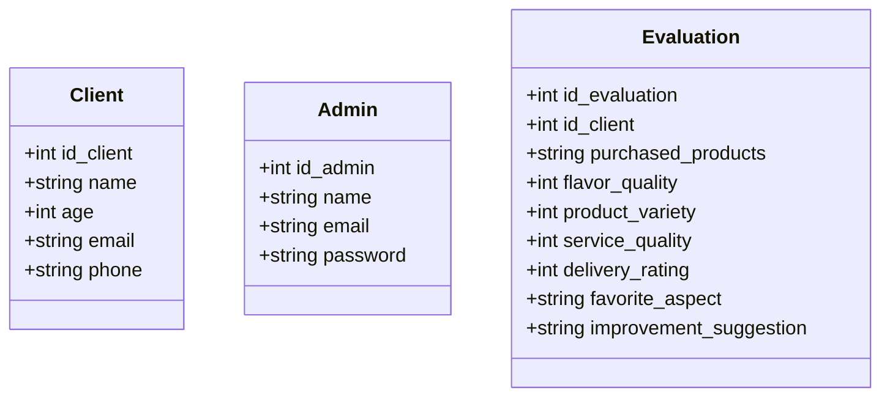

## Diagrama de Caso de Uso

## Diagrama Entidade-Relacionamento (DER)

```mermaid
	classDiagram
    class Client {
        +int id_client
        +string name
        +int age
        +string email
        +string phone
    }

    class Admin {
        +int id_admin
        +string name
        +string email
        +string password
    }

    class Evaluation {
        +int id_evaluation
        +int id_client
        +string purchased_products
        +int flavor_quality
        +int product_variety
        +int service_quality
        +int delivery_rating
        +string favorite_aspect
        +string improvement_suggestion
    }
``` 
